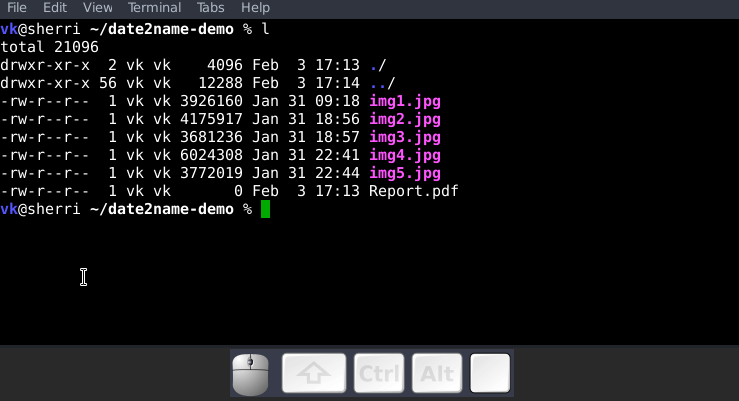

* Handling time-stamps and date-stamps in file names

#+BEGIN_HTML

#+END_HTML

Per default, date2name gets the modification time of matching files
and directories and adds a datestamp in standard ISO 8601+ format
YYYY-MM-DD (http://datestamps.org/index.shtml) at the beginning of
the file- or directoryname.

If an existing timestamp is found, its style will be converted to the
selected ISO datestamp format but the numbers stays the same.
Executed with an examplefilename "file" this results e.g. in
"2008-12-31_file".

Note: Other that defined in ISO 8601+ the delimiter between hours,
minutes, and seconds is not a colon but a dot. Colons are causing
several problems on different file systems and are there fore replaced
with the (older) DIN 5008 version with dots.

: Usage:
:          date2name [options] file ...

Run "date2name --help" for usage hints such as:

: Options:
:   -h, --help         show the extended help message and exit
:   -d, --directories  modify only directory names
:   -f, --files        modify only file names
:   -S, --short        use short datestamp               (YYMMDD)
:   -C, --compact      use compact datestamp             (YYYYMMDD)
:   -M, --month        use datestamp with year and month (YYYY-MM)
:   -w, --withtime     use datestamp including seconds   (YYYY-MM-DDThh.mm.ss)
:   -r, --remove       remove all known datestamps
:   -m, --mtime        take modification time for datestamp [default]
:   -c, --ctime        take creation time for datestamp
:   --delimiter        overwrite default delimiter
:   --nocorrections    do not convert existing datestamps to new format
:   -q, --quiet        do not output anything but just errors on console
:   -v, --verbose      enable verbose mode
:   -s, --dryrun       enable dryrun mode: just simulate what would happen, do
:                      not modify files or directories
:   --version          display version and exit

* Installation

First, you need the programming platform [[https://www.python.org/downloads/][Python]] installed.

Then, you can

1. get =date2name= manually from [[https://github.com/novoid/date2name][GitHub]] OR
2. install it via =pip install date2name= which is simplest method.

[[https://0dependencies.dev/0dependencies.svg]] → [[https://0dependencies.dev/][learn more about 0dependencies]]

* Integration Into Common Tools

** Integration into Windows File Explorer

The easiest way to integrate =date2name= into File Explorer ("Send to"
context menu) is by using [[https://github.com/novoid/integratethis][integratethis]].

Execute this in your command line environment:

: pip install date2name integratethis
: integratethis date2name
: integratethis time2name

*** Manual Integration into Windows Explorer for single files

Use this only if the [[https://github.com/novoid/integratethis][integratethis]] method can not be applied:

Create a registry file =add_date2name_to_context_menu.reg= and edit it
to meet the following template. Please make sure to replace the paths
(python, =USERNAME= and =date2name.py=) accordingly:

#+BEGIN_EXAMPLE
Windows Registry Editor Version 5.00

;; for files:

[HKEY_CLASSES_ROOT\*\shell\date2name]
@="date2name (single file)"

[HKEY_CLASSES_ROOT\*\shell\date2name\command]
@="C:\\Python36\\python.exe C:\\Users\\USERNAME\\src\\date2name\\date2name.py -i \"%1\""
#+END_EXAMPLE

Execute the reg-file, confirm the warnings (you are modifying your
Windows registry after all) and cheer up when you notice "date2name
(single file)" in the context menu of your Windows Explorer.

As the heading and the link name suggests: [[https://stackoverflow.com/questions/6440715/how-to-pass-multiple-filenames-to-a-context-menu-shell-command][this method works on single
files]]. So if you select three files and invoke this context menu item,
you will get three different filetag-windows to tag one file each.

** Integration into Thunar

[[https://en.wikipedia.org/wiki/Thunar][Thunar]] is a popular GNU/Linux file browser for the xfce environment.

Unfortunately, it is rather complicated to add custom commands to
Thunar. I found [[https://askubuntu.com/questions/403922/keyboard-shortcut-for-thunar-custom-actions][a good description]] which you might want to follow.

To my disappoinment, even this manual confguration is not stable
somehow. From time to time, the IDs of ~$HOME/.config/Thunar/uca.xml~
and ~$HOME/.config/Thunar/accels.scm~ differ.

For people using Org-mode, I automated the updating process (not the
initial adding process) to match IDs again:

Script for checking "tag": do it ~tag-ID~ and path in ~accels.scm~ match?
: #+BEGIN_SRC sh :var myname="tag"
: ID=`egrep -A 2 "<name>$myname" $HOME/.config/Thunar/uca.xml | grep unique-id | sed 's#.*<unique-id>##' | sed 's#<.*$##'`
: echo "$myname-ID of uca.xml: $ID"
: echo "In accels.scm: "`grep -i "$ID" $HOME/.config/Thunar/accels.scm`
: #+END_SRC

If they don't match, following script re-writes ~accels.scm~ with the current ID:
: #+BEGIN_SRC sh :var myname="tag" :var myshortcut="<Alt>t"
: ID=`egrep -A 2 "<name>$myname" $HOME/.config/Thunar/uca.xml | grep unique-id | sed 's#.*<unique-id>##' | sed 's#<.*$##'`
: echo "appending $myname-ID of uca.xml to accels.scm: $ID"
: mv $HOME/.config/Thunar/accels.scm $HOME/.config/Thunar/accels.scm.OLD
: grep -v "\"$myshortcut\"" $HOME/.config/Thunar/accels.scm.OLD > $HOME/.config/Thunar/accels.scm
: rm $HOME/.config/Thunar/accels.scm.OLD
: echo "(gtk_accel_path \"<Actions>/ThunarActions/uca-action-$ID\" \"$myshortcut\")" >> $HOME/.config/Thunar/accels.scm
: #+END_SRC

** Integration into FreeCommander

[[http://freecommander.com/en/summary/][FreeCommander]] is a [[https://en.wikipedia.org/wiki/File_manager#Orthodox_file_managers][orthodox file manager]] for Windows. You can add
date2name as an favorite command:

- Tools → Favorite tools → Favorite tools edit... (S-C-y)
  - Create new toolbar (if none is present)
  - Icon for "Add new item"
    - Name: date2name
    - Program or folder: <Path to date2name.bar>
	- =date2name.bat= looks like: (please do modify the paths to meet your requirement)
        : C:\Python36\python.exe C:\Users\YOURUSERNAME\src\date2name\date2name %*
	  : REM optionally: set /p DUMMY=Hit ENTER to continue...
    - Start folder: =%ActivDir%=
    - Parameter: =%ActivSel%=
    - [X] Enclose each selected item with ="=
    - Hotkey: select next available one such as =Ctrl-1= (it gets overwritten below)
	- remember its name such as "Favorite tool 01"
  - OK

So far, we've got =date2name= added as a favorite command which can be
accessed via menu or icon toolbar and the selected keyboard shortcut.
If you want to assign a different keyboard shortcut than =Ctrl-1= like
=Alt-d= you might as well follow following procedure:

- Tools → Define keyboard shortcuts...
  - Scroll down to the last section "Favorite tools"
  - locate the name such as "Favorite tool 01"
  - Define your shortcut of choice like =Alt-d= in the right hand side of the window
    - If your shortcut is taken, you'll get a notification. Don't
      overwrite essential shortcuts you're using.
  - OK

* Related Tools and Workflows
# --- BEGIN SHARED: how_to_thank_me --- see https://github.com/novoid/screencasts/

I'm glad if you like my tool. I've got way more projects on:

- [[https://github.com/novoid/][GitHub]] (oldest projects),
- [[https://gitlab.com/publicvoit/][GitLab.com]] (older projects), and
- [[https://codeberg.org/publicvoit/][Codeberg]] (newest projects).

If you want to support me:

- [[https://karl-voit.at/2018/06/07/cardware/][Send old-fashioned *postcard* per snailmail]] - I love personal feedback!
  - see [[http://tinyurl.com/j6w8hyo][my address]]
- Send feature wishes or improvements as an issue 
- Create issues for bugs
- Contribute merge requests for bug fixes
- Check out my other cool projects on the platforms above

If you want to contribute to this cool project, please fork and
contribute!

I am using [[http://www.python.org/dev/peps/pep-0008/][Python PEP8]] and occasionally some ideas from [[http://en.wikipedia.org/wiki/Test-driven_development][Test Driven
Development (TDD)]]. I fancy Python3 with [[https://typing.python.org/en/latest/spec/annotations.html][type annotations]], although I'm
not using them everywhere at the moment. Starting with 2025, I began
to use help from Claude.ai which is a huge improvement, given my lack
of programming practice and knowledge.

After all, each of my tools was developed because I needed its
functionality and could not get it elsewhere - at least to my
knowledge or taste.

# --- END SHARED: how_to_thank_me --- see https://github.com/novoid/screencasts/

* How to Thank Me and Contribute to the Poroject
# --- BEGIN SHARED: filetags_tools --- see https://github.com/novoid/screencasts/

This tool is part of a tool-set which I use to manage my digital files
such as photographs. My work-flows are described in [[http://karl-voit.at/managing-digital-photographs/][this blog posting]]
you might like to read and in the video which is linked above.

In short:

- For *tagging*, please refer to [[https://github.com/novoid/filetags][filetags]] and its documentation. It's
  the most important part of the whole concept on how I manage files.

- See [[https://github.com/novoid/date2name][date2name]] for easily adding ISO *time-stamps or date-stamps* to files.

- For *easily naming and tagging* files within file browsers that
  allow integration of external tools, see [[https://github.com/novoid/appendfilename][appendfilename]] (once more)
  and [[https://github.com/novoid/filetags][filetags]].

- Moving to the archive folders is done using [[https://github.com/novoid/move2archive][move2archive]].

- Naming files is tedious. Therefore, I wrote [[https://github.com/novoid/guess-filename.py/][guessfilename]]:
  Python-script, guesses according to file name, optional PDF content,
  optional video json metadata.

- Having tagged photographs gives you many advantages. For example, I
  automatically [[https://github.com/novoid/set_desktop_background_according_to_season][choose my *desktop background image* according to the
  current season]].

- Files containing an ISO time/date-stamp gets indexed by the
  filename-module of [[https://github.com/novoid/Memacs][Memacs]].

-----------

- Alternative implementations of the =filetags= concept:
  - [[https://github.com/beutelma/filetags.el][GitHub - DerBeutlin/filetags.el: Emacs package to manage filetags in the filename]]
  - With [[https://github.com/protesilaos/denote][denote]], Protesilaos Stavrou implemented a conceptually
    related approach to manage notes within an Emacs buffer. With
    [[https://en.wikipedia.org/wiki/Dired][Emacs/dired]], this method equally may be applied on files, too.

- Related to =date2name=:
  - https://github.com/DerBeutlin/date2name.el Alternative implementation for [[https://en.wikipedia.org/wiki/Dired][Emacs/dired]]
  - https://github.com/muehlburger/d2n Alternative implementation in [[https://go.dev/][Go]]

- Related to =m2a=:
  - https://github.com/velvet-jones/imgfiler/

- Related to =guessfilename=:
  - [[http://www.jonasjberg.com/][Jonas Sjöberg]] took my idea and developed the much more advanced (and
    thus a bit more complicated) [[https://github.com/jonasjberg/autonameow][autonameow]]. It uses rule-based renaming,
    analyzes content of plain text, epub, pdf and rtf files, extracts
    meta-data from many different file formats via [[https://www.sno.phy.queensu.ca/%257Ephil/exiftool/][exiftool]] and so forth.
  - [[https://www.reddit.com/r/datacurator/comments/f6ku5p/building_an_auto_file_sorter_need_requirements/][This reddit thread]] brought me to [[https://github.com/unreadablewxy/fs-curator][fs-curator]] whose [[https://github.com/unreadablewxy/fs-curator/wiki][documentation]] looks
    promising. I did not test it and it's still in an early stage.
    However, it could be a future user-friendly part of a workflow that
    watches folders for file changes and applies processes like
    guessfilename.
  - I you don't need the full power of a programming language,
    [[https://github.com/tfeldmann/organize][organize]] might do the trick for you. Instead of coding Python, you
    define your rules within a text file. For many people, this may
    seem more user friendly.

----------

- A research platform for testing file-tagging on all platforms: [[https://karl-voit.at/tagstore/][tagstore]]
  - This happens to be an important part of [[https://karl-voit.at/tagstore/downloads/Voit2012b.pdf][my PhD thesis]] in PIM.
  - Not maintained since 2013 any more but surely still a cool
    starting point in case you want to get a flexible tool when doing
    research with tagging interfaces.

- Good resources for tagging software in general
  - [[https://turbofuture.com/computers/Whats-the-Best-Software-for-Tagging-Files-A-Review][What's the Best Software for Tagging Files? | TurboFuture]]
  - "Marktübersicht von Tagging-Werkzeugen und Vergleich mit tagstore" (German, 2013): linked on [[https://karl-voit.at/tagstore/en/papers.shtml][this page]] of the [[https://karl-voit.at/tagstore/][tagstore project]]

- If you do like filetags but you prefer the syntax of [[https://www.tagspaces.org/][TagSpaces]] for
  adding tags to file names, you should check out [[https://github.com/jgru/filetags][this filetags fork]].
  Maintenance is limited though. Please notice that my other tools
  working with tags do not support TagSpaces-style either.

- https://forge.chapril.org/tykayn/rangement.git
  - An NPM implementation of a subset of GuessFileName (using image exif header), append2name, move2archive
  - You probably need to read a bit of French
# --- END SHARED: filetags_tools --- see https://github.com/novoid/screencasts/
